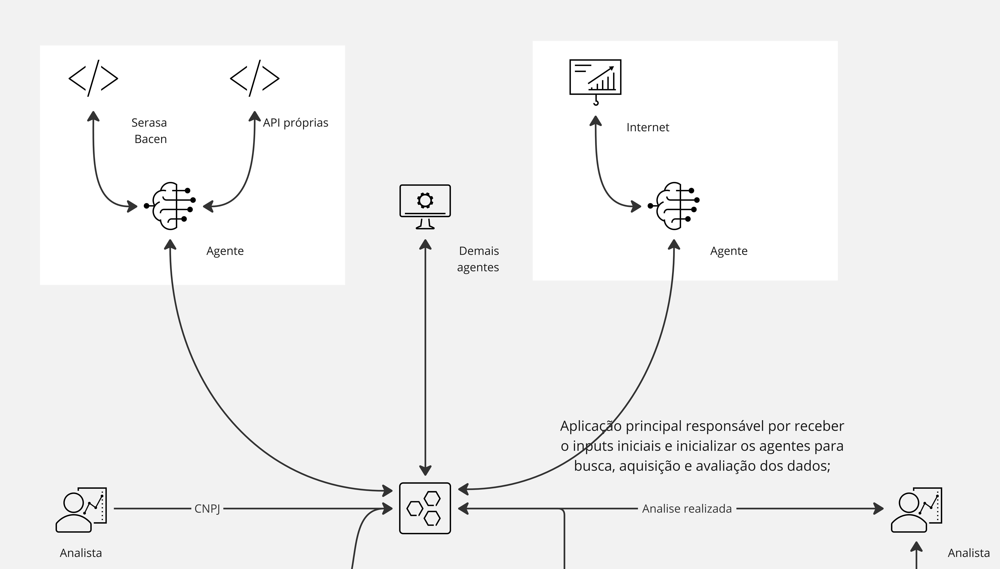
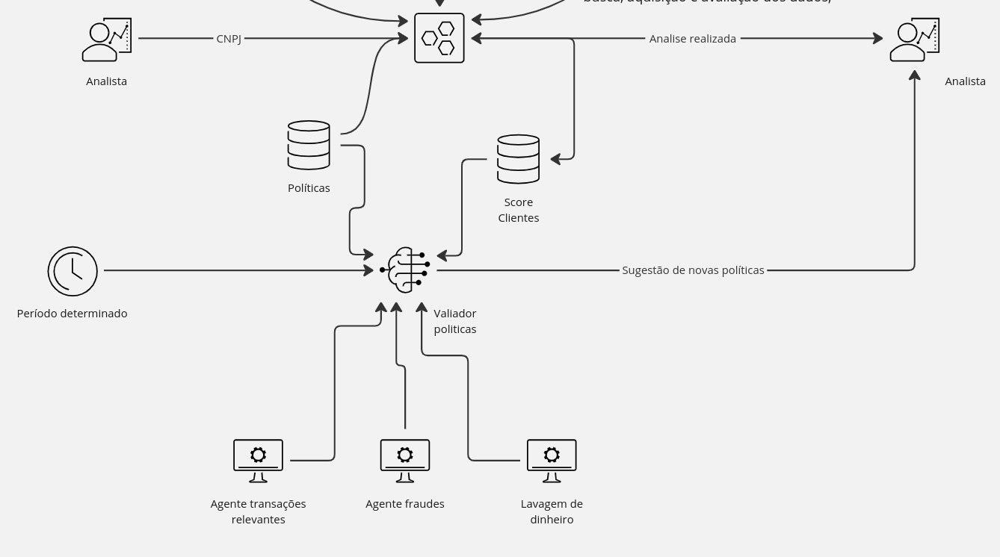

# Arya

Baseando-se em dados transacionais do cliente, interações com a instituição e critérios de due diligence, propomos novos atributos de avaliação para a instituição. O objetivo é facilitar a manutenção de análise para o perfil de clientes existentes e o onboarding de novos clientes, integrando informações relevantes por meio de APIs de terceiros ou da própria instituição.

## Os Agentes

Atualmente, as empresas utilizam, em sua maioria, atributos qualitativas para avaliar dados quantitativos provenientes de diversas fontes, internas ou externas à instituição. Para apoiar esse processo, desenvolvemos dois agentes: um para trabalhar e avaliar dados qualitativos, e outro para dados quantitativos. A criação desses agentes demonstra a eficácia dos LLMs (Large Language Models), gerando análises coerentes e consistentes com base nos atributos da empresa, além de fornecer uma pontuação baseada no due diligence. Para mais detalhes sobre os agentes, acesse a respectiva pasta onde uma explicação detalhada é fornecida.

# Copilot

A principal IA utilizada no projeto é o `Validador de Atributos`, que é responsável por receber os dados analisados pelo módulo de due diligence e, em conjunto com a avaliação de desempenho dos clientes, utilizando uma arquitetura similar à aplicada em due diligence. No entanto, neste caso, são usadas as informações da própria instituição para avaliar transações relevantes, como lavagem de dinheiro, fraudes, entre outras. 

Entendemos que este agente pode precisar passar por um fine-tuning, pois os dados que desejamos avaliar são bastante específicos. No entanto, mesmo sem esse procedimento, simulamos a aplicação e obtivemos resultados promissores em um LLM que recebeu informações de clientes, atributos antigas e análises comportamentais dos clientes. Isso permitiu que o LLM gerasse atributos plausíveis. Com um maior volume de dados e um fine-tuning adequado, os resultados são promissores.
